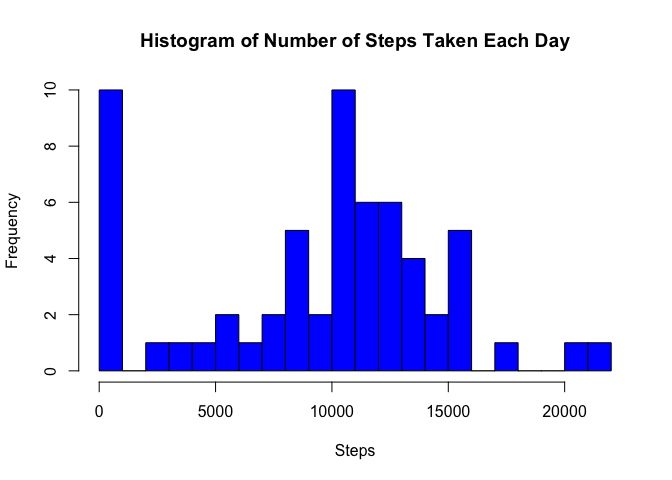
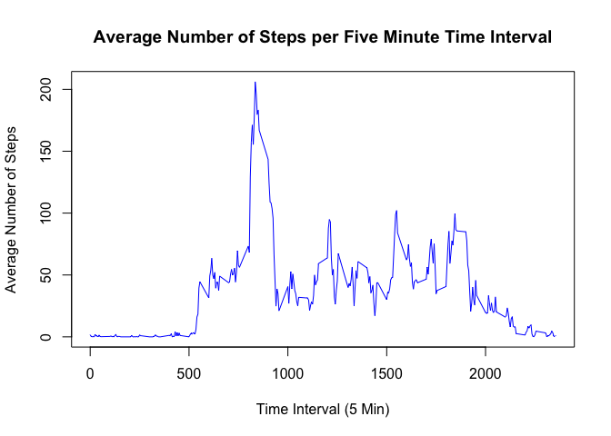
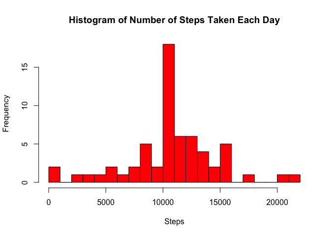
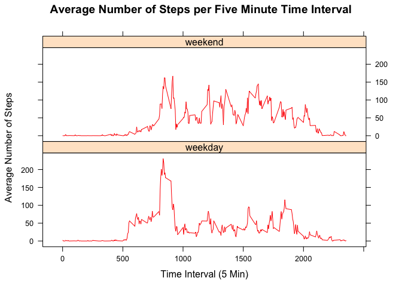

# Reproducible Research: Peer Assessment 1
Syqwester  
September 20, 2015  
### Load Libraries Need for Calculations and Plots


```r
library("dplyr")
```

```
## 
## Attaching package: 'dplyr'
## 
## The following objects are masked from 'package:stats':
## 
##     filter, lag
## 
## The following objects are masked from 'package:base':
## 
##     intersect, setdiff, setequal, union
```

```r
library('lattice')
```
##  Loading and preprocessing the data

```r
setwd("~/Documents/Magic Briefcase/Computer/Data_science_Track1/Data_Reprod")
fit <- read.csv("activity.csv")
options(scipen=999)   # Turns off scientific notation
```
## What is mean total number of steps taken per day?

###     Calculate the total number of steps taken per day

```r
fitS <- fit%>%
  group_by(date)%>%
    summarize(Total_Steps = sum(steps,na.rm=T))
```

### Make a histogram of the total number of steps taken each day

```r
    hist(fitS$Total_Steps,
         breaks = length(fitS$date)/2,
         col="blue",
         xlab= "Steps",
         main = "Histogram of Number of Steps Taken Each Day"
         )
```

 

### Calculate/report the mean and median of the total number of steps taken per day


```r
    steps.mean = round(mean(fitS$Total_Steps),2)
    steps.med =  round(median(fitS$Total_Steps),2)
    steps.mean
```

```
## [1] 9354.23
```

```r
    steps.med
```

```
## [1] 10395
```
Mean 9354.23 

Median 10395

## What is the average daily activity pattern?


```r
    fitT <- fit%>%
      group_by(interval)%>%
      summarize(Avg_Steps = mean(steps,na.rm=T))
```

### Make a time series plot


```r
    plot(fitT$interval, fitT$Avg_Steps, 
         type="l", col="blue",
         xlab = "Time Interval (5 Min)",
         ylab = "Average Number of Steps",
         main = "Average Number of Steps per Five Minute Time Interval"
         )
```

 

### Which 5-minute interval contains the maximum number of steps?


```r
    int.max <- fitT[fitT$Avg_Steps==max(fitT$Avg_Steps),1]
    int.max
```

```
## Source: local data frame [1 x 1]
## 
##   interval
##      (int)
## 1      835
```
Interval with Max steps: 835

## Imputing missing values

### Calculate and report the total number of missing values in the dataset 


```r
    fitNA <- sum(is.na(fit$steps))
    fitNA
```

```
## [1] 2304
```
Missing values:  2304

### Devise a strategy for filling in all of the missing values in the dataset
    Replace NA's with 5 minute average interval for that interval

```r
    fitNA <- fit
      for (i in 1:nrow(fitNA)) {
        if (is.na(fitNA$steps[i])) {
          fitNA$steps[i]<- fitT$Avg_Steps[fitT$interval == fitNA$interval[i]]
        }
      }
```
### Create a new dataset that is equal to the original dataset but with the missing data filled in.

```r
    fitNAS <- fitNA%>%
      group_by(date)%>%
      summarize(Total_Steps = sum(steps,na.rm=T))
```
### Make a histogram of the total number of steps taken each day 

```r
    hist(fitNAS$Total_Steps,
         breaks = length(fitS$date)/2,
         col="red",
         xlab= "Steps",
         main = "Histogram of Number of Steps Taken Each Day"
    )
```

 
### Report the mean and median total number of steps taken 

```r
    steps.mean2 = round(mean(fitNAS$Total_Steps),2)
    steps.med2 =  round(median(fitNAS$Total_Steps),2)
    steps.mean2
```

```
## [1] 10766.19
```

```r
    steps.med2
```

```
## [1] 10766.19
```
Mean 10766.19

Median 10766.19

### What is the impact of imputing missing data on the estimates of the total daily steps?  
  The mean and median both go up due to the removal of the conversion of NA's to 0's     in the original computations, which is quite obvious by looking at the histgram.
    
## Are there differences in activity patterns between weekdays and weekends?

### Create a new factor variable in the dataset with two levels 

```r
    # Convert date column to Date formate
    # Define Weekend
    WE = c("Saturday","Sunday")
    fitNA$date <- as.Date(fitNA$date, "%Y-%m-%d")
    fitWD<- fitNA %>%
      mutate(day = weekdays(date))
      WEI =fitWD$day%in%WE      # Weekends
      WDI = !fitWD$day%in%WE      # Weekdays
      fitWD$day[which(WEI)] <- "weekend"
      fitWD$day[which(WDI)] <- "weekday"
      fitWD$day <- as.factor(fitWD$day)
```
### Make a panel plot containing a time series plot 

```r
      fitNAT <- fitWD%>%
        group_by(interval,day)%>%
        summarize(Avg_Steps = mean(steps,na.rm=T))
      
      xyplot(fitNAT$Avg_Steps ~ fitNAT$interval | fitNAT$day, 
             layout = c(1, 2), type = "l", 
             col = "red",
             xlab = "Time Interval (5 Min)", 
             ylab = "Average Number of Steps",
             main = "Average Number of Steps per Five Minute Time Interval"
             )
```

 
